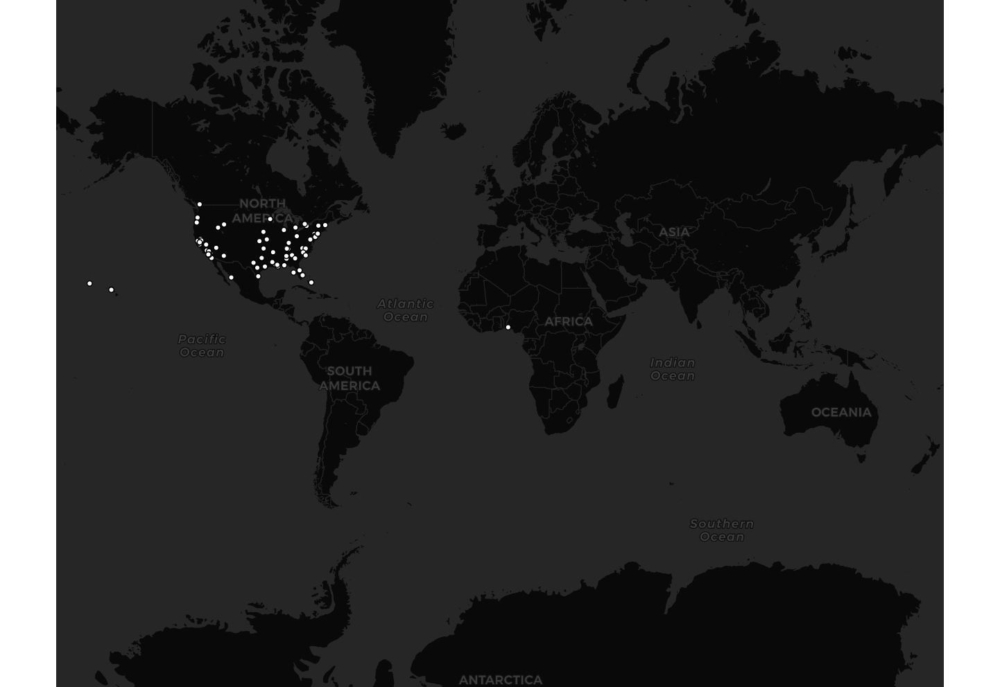

# geog458_lab2

## Generated Map

## Narrative
With this generated map, a Tweet crawler using a parameter filter of "Protests" collected
Tweets from all around the world. When the data was collected, there was a lot of protests
ongoing in the United States for various reasons, and there were protests in Russia over
recent corruption scandals involving President Putin. Considering these two facts, it was
expected that Tweets would have been collected mainly from the United States and Russia.
Surprisingly enough, no Tweets were found in Russia amongst the ones that were collected.
However, there was a single Tweet collected from Nigeria. It would be interesting to know
why no Tweets were collected from Russia, considering the aforementioned political atmosphere.
